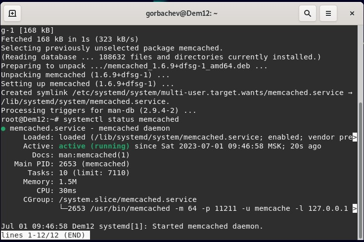

# Домашнее задание к занятию 11.2 "Кеширование Redis/memcached" - `Горбачев Олег`

### Задание 1. Кэширование.
Приведите примеры проблем, которые может решить кэширование.
Приведите ответ в свободной форме.
### Ответ
- Повышение производительности.
- Увеличение скорости ответа.
- Экономия ресурсов.
- Сглаживание бустов трафика.
---

### Задание 2. Memcached.
Установите и запустите memcached.
*Приведите скриншот systemctl status memcached, где будет видно, что memcached запущен.*
### Ответ:
*выполняем обновление и устанавливаем*
```shell
sudo apt update && apt install memcached
```
*проверяем статус*
```shell
systemctl status memcached
```

---

### Задание 3. Удаление по TTL в Memcached.
Запишите в memcached несколько ключей с любыми именами и значениями, для которых выставлен TTL 5.
Приведите скриншот, на котором видно, что спустя 5 секунд ключи удалилсь из базы.
### Ответ
---

### Задание 4.
Запись данных в Redis.
Запишите в redis несколько ключей с любыми именами и значениями.
Через redis-cli достаньте все записанные ключи и значения из базы, приведите скриншот этой операции.
### Ответ
---
